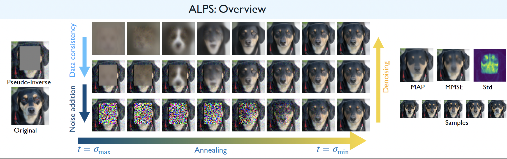

# Annealed Langevin Posterior Sampling (ALPS) using distilled energy-based models

# Introduction
We introduce energy-based posterior sampling algorithm for inverse problems to derive the Minimum Mean Square Error (MMSE), uncertainty, and 
the Maximum A Posteriori (MAP) estimates. 

Leveraging the compositionality of energy-based models, we define a family of static posterior distributions parameterized by $t$, which converges to the true posterior as $t \to 0$.  These posteriors are sampled using Annealed Langevin Posterior Sampling (ALPS), which alternates between denoising via the EBM score, enforcing data consistency through quadratic optimization, and adding noise. This annealing strategy yields efficient inference with fewer steps and avoids backpropagation through the score or forward model.

# Sampling trajectory of ALPS for different inverse problems

